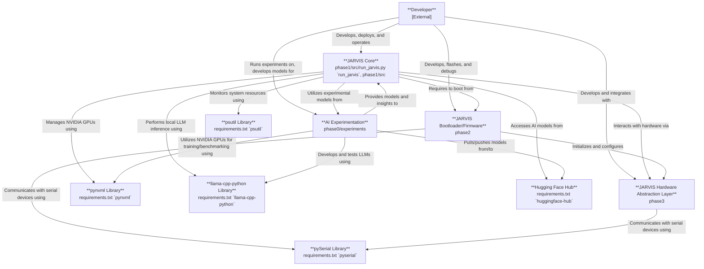

# Unnamed CodeViz Diagram

```mermaid
graph TD

    base.cv::developer["**Developer**<br>[External]"]
    base.cv::jarvis_core["**JARVIS Core**<br>phase1/src/run_jarvis.py `run_jarvis`, phase1/src"]
    base.cv::ai_experiments["**AI Experimentation**<br>phase0/experiments"]
    base.cv::jarvis_bootloader["**JARVIS Bootloader/Firmware**<br>phase2"]
    base.cv::jarvis_hal["**JARVIS Hardware Abstraction Layer**<br>phase3"]
    base.cv::psutil_lib["**psutil Library**<br>requirements.txt `psutil`"]
    base.cv::pyserial_lib["**pySerial Library**<br>requirements.txt `pyserial`"]
    base.cv::pynvml_lib["**pynvml Library**<br>requirements.txt `pynvml`"]
    base.cv::llama_cpp_lib["**llama-cpp-python Library**<br>requirements.txt `llama-cpp-python`"]
    base.cv::huggingface_hub_ext["**Hugging Face Hub**<br>requirements.txt `huggingface-hub`"]
    %% Edges at this level (grouped by source)
    base.cv::developer["**Developer**<br>[External]"] -->|"Develops, deploys, and operates"| base.cv::jarvis_core["**JARVIS Core**<br>phase1/src/run_jarvis.py `run_jarvis`, phase1/src"]
    base.cv::developer["**Developer**<br>[External]"] -->|"Runs experiments on, develops models for"| base.cv::ai_experiments["**AI Experimentation**<br>phase0/experiments"]
    base.cv::developer["**Developer**<br>[External]"] -->|"Develops, flashes, and debugs"| base.cv::jarvis_bootloader["**JARVIS Bootloader/Firmware**<br>phase2"]
    base.cv::developer["**Developer**<br>[External]"] -->|"Develops and integrates with"| base.cv::jarvis_hal["**JARVIS Hardware Abstraction Layer**<br>phase3"]
    base.cv::jarvis_core["**JARVIS Core**<br>phase1/src/run_jarvis.py `run_jarvis`, phase1/src"] -->|"Requires to boot from"| base.cv::jarvis_bootloader["**JARVIS Bootloader/Firmware**<br>phase2"]
    base.cv::jarvis_core["**JARVIS Core**<br>phase1/src/run_jarvis.py `run_jarvis`, phase1/src"] -->|"Interacts with hardware via"| base.cv::jarvis_hal["**JARVIS Hardware Abstraction Layer**<br>phase3"]
    base.cv::jarvis_core["**JARVIS Core**<br>phase1/src/run_jarvis.py `run_jarvis`, phase1/src"] -->|"Utilizes experimental models from"| base.cv::ai_experiments["**AI Experimentation**<br>phase0/experiments"]
    base.cv::jarvis_core["**JARVIS Core**<br>phase1/src/run_jarvis.py `run_jarvis`, phase1/src"] -->|"Monitors system resources using"| base.cv::psutil_lib["**psutil Library**<br>requirements.txt `psutil`"]
    base.cv::jarvis_core["**JARVIS Core**<br>phase1/src/run_jarvis.py `run_jarvis`, phase1/src"] -->|"Manages NVIDIA GPUs using"| base.cv::pynvml_lib["**pynvml Library**<br>requirements.txt `pynvml`"]
    base.cv::jarvis_core["**JARVIS Core**<br>phase1/src/run_jarvis.py `run_jarvis`, phase1/src"] -->|"Performs local LLM inference using"| base.cv::llama_cpp_lib["**llama-cpp-python Library**<br>requirements.txt `llama-cpp-python`"]
    base.cv::jarvis_core["**JARVIS Core**<br>phase1/src/run_jarvis.py `run_jarvis`, phase1/src"] -->|"Accesses AI models from"| base.cv::huggingface_hub_ext["**Hugging Face Hub**<br>requirements.txt `huggingface-hub`"]
    base.cv::ai_experiments["**AI Experimentation**<br>phase0/experiments"] -->|"Provides models and insights to"| base.cv::jarvis_core["**JARVIS Core**<br>phase1/src/run_jarvis.py `run_jarvis`, phase1/src"]
    base.cv::ai_experiments["**AI Experimentation**<br>phase0/experiments"] -->|"Utilizes NVIDIA GPUs for training/benchmarking using"| base.cv::pynvml_lib["**pynvml Library**<br>requirements.txt `pynvml`"]
    base.cv::ai_experiments["**AI Experimentation**<br>phase0/experiments"] -->|"Develops and tests LLMs using"| base.cv::llama_cpp_lib["**llama-cpp-python Library**<br>requirements.txt `llama-cpp-python`"]
    base.cv::ai_experiments["**AI Experimentation**<br>phase0/experiments"] -->|"Pulls/pushes models from/to"| base.cv::huggingface_hub_ext["**Hugging Face Hub**<br>requirements.txt `huggingface-hub`"]
    base.cv::jarvis_bootloader["**JARVIS Bootloader/Firmware**<br>phase2"] -->|"Initializes and configures"| base.cv::jarvis_hal["**JARVIS Hardware Abstraction Layer**<br>phase3"]
    base.cv::jarvis_bootloader["**JARVIS Bootloader/Firmware**<br>phase2"] -->|"Communicates with serial devices using"| base.cv::pyserial_lib["**pySerial Library**<br>requirements.txt `pyserial`"]
    base.cv::jarvis_hal["**JARVIS Hardware Abstraction Layer**<br>phase3"] -->|"Communicates with serial devices using"| base.cv::pyserial_lib["**pySerial Library**<br>requirements.txt `pyserial`"]

```
---
*Generated by [CodeViz.ai](https://codeviz.ai) on 3/20/2026, 3:22:57 PM*
