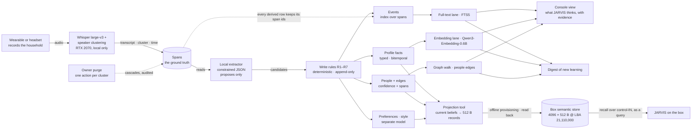

# Phase 7 — Memory Store Design: the household memory that goals 7.1, 7.5 and 7.8 share

**Status:** DESIGN — approved by the operator 2026-09-06 after a three-approach dialogue (approach A below; the extractor runs LOCAL ONLY; the box receives its projection by offline provisioning first). Strategist-authored, plan-first, committed as-is by the coder under an md5 gate (the research memo's precedent). No code is implied by this document; the first code lands under the MS0 board row of §11. The research it rests on is `phase7/docs/PHASE_7_MEMORY_RESEARCH.md` — its §8 nine implications and §8a what the verification votes changed — and every number quoted from that memo keeps the memo's own verification status. Nothing here is a measurement of JARVIS; the bands in §8 are pre-registered before any run.

**One sentence:** three layers (events, profile facts, people) plus a separate preference-and-style model, all over one provenance spine that points back to the verbatim transcript; a deterministic, append-only write path that the language model can add to but never rewrite; retrieval that always returns the span it stands on; our own household benchmark; and a compact projection of current beliefs into the box's existing 4096-slot semantic store.

---

## 0. The decisions this design rests on

**The operator's, recorded in `phase4/docs/BEYOND_PHASE7_VOICE_WEARABLE.md` §8 (2026-09-05/06):** only the owner enrolls; JARVIS must GUESS, over days and untold, that the recurring second voice is his wife and who she is to him; everything is transcribed, raw audio is deleted after transcription, and speech that is neither his nor his wife's is his to purge by hand, one clean action per speaker cluster (his accepted legal risk, recorded not hidden); inferred facts carry a confidence and are USED without confirmation, correction possible never required; the store is purpose-built and to be state of the art, worth a whole phase; the profile is recallable over control-IN, visible on a CLEAN console view, and surfaced in a digest; learning happens on the Main PC, the box receives distilled facts only; training never on the box.

**Taken in the design dialogue of 2026-09-06 (the operator's answers to the strategist):**

1. **The extractor runs LOCAL ONLY.** A model on the RTX 2070 does every extraction over real household transcripts; no household transcript ever leaves the Main PC. A cloud model may be used ONLY to generate SYNTHETIC benchmark transcripts from planted ground truth (§8), never to read a real one. Zero running cost; extraction quality becomes the measured weakest link rather than an assumption.
2. **Approach A — one SQLite file as the spine** — chosen over B (an embedded graph database such as Kuzu) and C (append-only JSONL logs with rebuilt indexes). Rationale: every write is a transaction, so audit rows and supersession chains are trivial and replayable; FTS5 gives the BM25 baseline lane for free; at household scale (thousands of facts, tens of thousands of events) a flat vector scan is milliseconds and the people graph is small enough to walk in Python; backup is a file copy. B forces bitemporal audit rows into a model that does not want them and adds a young dependency for gains the research shows only on multi-hop questions; C grows into A with worse tooling.
3. **The graph question is a measured escape hatch, not a pre-commitment.** The benchmark's who-is-what-to-whom and multi-hop set (§8) is scored against the hand-walked graph at MS2; an embedded graph store is tried only if that set misses its band.
4. **Extractor candidates, in order, measured before trust:** Gemma 4 E2B (the deployed model, known behaviour), Llama 3.1 8B at 4-bit (fits the 2070, ranked first on the fixed-harness re-bench), an encoder-style joint entity-relation extractor as the cheap third. Constrained JSON output only; free text never enters the store.
5. **The box receives its projection by OFFLINE provisioning first:** a Main-PC tool writes the current-beliefs set into the box's existing semantic store region while the box sits on Ubuntu, with the backup, device read-back and neighbour-sector discipline the key and console slots used. A live push over the network would be the box's first standing WRITE path from outside; it is a later, separately gated slice with its own ADR, and control-IN stays a query channel until then.

**The memo's nine implications, each mapped to the section that carries it:** 1 route-by-fact-type over one spine → §2, §3; 2 the LLM off the write path → §4; 3 inference never feeds itself → §3.4, §4 R5; 4 a separate preference and style model → §7; 5 our own pre-registered benchmark → §8; 6 feasible on the 2070 by construction → §0 item 1, §5, §10; 7 forgetting is demotion → §4 R6, §6; 8 the box receives a projection → §9; 9 the honest ceiling → §13.

Sources: `phase4/docs/BEYOND_PHASE7_VOICE_WEARABLE.md` §8; `phase7/docs/PHASE_7_MEMORY_RESEARCH.md` §8, §8a, §10; the operator's answers of 2026-09-06 (this session).

---

## 1. Purpose — one memory, three goals

| Goal (canon, `ROADMAP.md:115-122`) | Its done-when (`ROADMAP.md:126-133`) | What this store contributes | What it does NOT change by itself |
|---|---|---|---|
| 7.1 Associative memory | associative retrieval returns relevant memory for paraphrased queries, test suite ≥ 80 % | typed, sourced facts and a far larger, cleaner corpus than the control-IN store; the same Qwen3-Embedding-0.6B in the embedding lane; the projection (§9) as the box's fact source | the box's own recall lane and its 19/36 = 53 % baseline at the 0.55 floor — 7.1's measurement stays the box-side paraphrase suite, and the store's contribution to it is measured there, never assumed |
| 7.5 Cross-session personality | consistent tone, remembered inside jokes, acknowledged mistakes — grounded in stored facts, not roleplay | the profile, preference and style layers with every fact carrying its span; the audit rows are the "acknowledged mistakes" substrate | anything on the box — 7.5's rendering into the box's prompts is its own arc over the projection |
| 7.8 Household voice learning | days of recordings yield a household profile — who is who and to whom, style and preferences, habits, topics — each fact sourced, dated, stated-or-inferred with a confidence, used without confirmation; the wife identified; recall, a clean console view, a digest | the whole pipeline of §2: this store IS the "purpose-built, state-of-the-art memory store" the done-when names | the wearable, the console view's design and the digest's mechanism, which keep their own board rows |

Sources: `phase4/docs/ROADMAP.md:115-122,126-133`; `phase7/docs/PHASE_7_PLAN.md` §0, §3; CLAUDE.md row "C/M2b — SEMANTIC RECALL WIRED" (the 53 % baseline).

---

## 2. Architecture



**Reading the figure.** The transcript spans are the only ground truth; everything to their right is derived from them by rules and can be recomputed from them. The extractor proposes and the rules decide. Three lanes read the store; three surfaces consume the lanes; the box only ever receives a compact projection, written offline. The purge is the only delete in the system and it runs on spans, cascading to what only those spans produced.

**Venue.** Everything in the figure left of the box runs on the Main PC: the `phase7/memory/` package (§10), the data under `%USERPROFILE%\.jarvis\memory\`, the voice package's venv (torch for ECAPA, faster-whisper) plus the extractor runtime chosen at MS1. The RTX 2070 hosts Whisper (whole-GPU use measured at M0a: 2,870 MiB before the model, 6,605 MiB loaded, a 3,735 MiB delta) and the extractor in turn, never together; a transcript is extracted after its recording is transcribed, sequentially.

Sources: §0; `phase7/docs/PHASE_7_GOAL_8_VOICE.md` §2, §6 (the measured ASR footprint); `phase3/src/ai/semantic_store.h` (the box region).

---

## 3. Data model

One SQLite database, WAL mode, `household.sqlite`. Every table below is append-only except where a column is documented as set-once-later (`valid_to`, `superseded_by`, `deleted_audio_at`, `person_id` on a cluster). Row ids are monotonic integers; no row is ever renumbered.

### 3.1 The spine — recordings, spans, clusters

| table | columns | meaning |
|---|---|---|
| `recording` | `id`, `sha256`, `started_at` (UTC), `duration_s`, `device` (headset / wearable id), `transcribed_at`, `deleted_audio_at` | one per audio file; `sha256` is computed before transcription and survives the audio's deletion, so a span can always name the recording it came from even though the audio is gone |
| `span` | `id`, `recording_id`, `t_start_s`, `t_end_s`, `cluster_id`, `text` (verbatim ASR output), `asr_conf`, `said_at` (= `started_at` + `t_start_s`), `about_time` (nullable), `about_time_source` (`stated` / `extractor` / null) | the ground truth; `said_at` is dialogue time, `about_time` is occurrence time — kept separately because the research measured a 12-point gain from separating them; a span is never edited, only purged |
| `cluster` | `id`, `centroid` (blob, 192-d ECAPA), `n_spans`, `first_heard`, `days_heard` (distinct dates), `person_id` (nullable, set once when the cluster becomes a person) | a voice, not yet a person; the owner's cluster is bound at creation to the enrollment centroid from `%USERPROFILE%\.jarvis\voice\enroll\owner.json` at its M0b threshold |

### 3.2 The three layers

| table | columns | meaning |
|---|---|---|
| `event` + `event_span` | `id`, `text` (one self-contained natural-language unit with normalised entity names), `about_time`, `cluster_id`, `created_at`; `event_span(event_id, span_id)` | an INDEX over spans, never the truth — the votes refuted the anti-compression claim as causal, so retrieval must be able to fall through an event to its spans |
| `person` | `id`, `kind` (`owner` / `cluster`), `display_name` (nullable), `name_confidence`, `name_source_kind`, `created_at` | the owner (enrolled) and every cluster that has earned personhood (§5) |
| `fact` + `fact_span` | `id`, `subject_kind` (`person` / `household` / `topic`), `subject_id`, `predicate_id` (§4.1), `object_text`, `object_norm`, `source_kind` (`stated_owner` / `stated_other` / `inferred`), `speaker_person_id`, `confidence`, `valid_from`, `valid_to` (nullable), `recorded_at`, `superseded_by` (nullable); `fact_span(fact_id, span_id, role)` with `role` ∈ {`support`, `contradict`} | a typed, bitemporal profile fact: `valid_from`/`valid_to` are when the fact held in the world, `recorded_at` is when the store learned it; `superseded_by` points at the winner and is set exactly once |
| `edge` + `edge_span` | `id`, `from_person`, `to_person`, `relation_id` (§4.1), `source_kind`, `confidence`, `valid_from`, `valid_to`, `recorded_at`, `superseded_by`; `edge_span(edge_id, span_id, role)` | the people layer's relationships — "who is what to whom" — every edge carrying the spans it rests on |
| `audit` | `id`, `ts`, `op` (`supersede` / `demote` / `purge` / `reject`), `target_table`, `loser_id`, `winner_id` (nullable), `rule` (R1…R7 or `registry`), `note` | every loss, kept; the audit table is the reason "nothing is deleted silently" is a property rather than a promise |
| `embedding` | `owner_table`, `owner_id`, `model`, `dim`, `vec` (blob, float32) | vectors for events and facts from the deployed Qwen3-Embedding-0.6B; a flat scan at household scale, a vector extension only if a measured p99 says so |

### 3.3 Preferences and style — the separate model (§7)

| table | columns | meaning |
|---|---|---|
| `preference` + `preference_span` | `id`, `person_id`, `topic_norm`, `polarity` (`likes` / `dislikes` / `wants` / `avoids`), `strength` (1–3), `source_kind`, `confidence`, `valid_from`, `valid_to`, `recorded_at`, `superseded_by` | versioned and coexisting by construction: two preferences on the same topic are two rows until an owner statement closes one |
| `style_snapshot` | `id`, `person_id`, `window_from`, `window_to`, `n_spans`, `stats_json` | statistics over the OWNER'S spans only per window (utterance length, top n-grams, fillers, question rate, address forms); never over anyone else's speech |

### 3.4 Time and confidence — the two conventions

- **Three times, never conflated:** `said_at` (dialogue time, from the recording), `about_time` (occurrence time, inferred and nullable), `recorded_at` (transaction time). A fact's `valid_from` defaults to its `about_time` when the extractor or the speaker gave one, else its `said_at`. `valid_to` is null while the fact is current.
- **Stated facts carry a source, not a probability.** `source_kind` is the load-bearing field; `confidence` on a stated fact is 1.0 by convention and is never rendered as "100 % sure".
- **Inferred confidence is a pre-registered function of evidence days, recomputed from spans every time:** with `D_s` = distinct days carrying supporting spans and `D_c` = distinct days carrying contradicting spans, `confidence = 0` if `D_s ≤ D_c`, else `1 − exp(−(D_s − D_c) / τ)` with `τ = 3 days`. Three consistent days give 0.63, five give 0.81, seven give 0.90. It never reads an earlier inference, so a wrong belief cannot feed itself. The parameters (`τ`, the surfacing threshold 0.80) may change only through the benchmark, with the change and its measured reason recorded in this document.
- **Personhood is a rule:** a cluster becomes a `person` once heard on ≥ 3 distinct days with ≥ 5 spans on each of those days. Personhood gates only the EXISTENCE of the person row and its edges, never the evidence: when an edge is first computed it counts every retained span of that cluster, including those recorded before personhood, so a cluster that earns personhood on its third day can carry three evidence days on that same day (0.63) and reach the 0.80 surfacing threshold on its fifth consistent day — two days inside §8's seven-day band, and one contradicting day still leaves it inside.

Sources: `phase7/docs/PHASE_7_MEMORY_RESEARCH.md` §3 (bitemporal edges, the TSM time separation, the self-reinforcing-error mode), §4 (relationship confidence over days), §8 items 1–3; `phase7/voice/jarvis_voice/enroll.py` (the centroid), `speaker.py` (192-d ECAPA).

---

## 4. The write path — the predicate registry and rules R1–R7

### 4.1 The predicate registry — the K-b instinct applied to memory

The extractor SELECTS a predicate id from a static, human-reviewed table in code; it never invents a predicate, exactly as the action allowlist lets the model select an action id and never synthesise one. A candidate carrying an unknown `predicate_id` is not written; it becomes an `audit` row with `op = reject, rule = registry`.

| predicate_id | subject → object | arity | notes |
|---|---|---|---|
| `person.name` | person → text | single | a display name; the owner's is set at enrollment, a cluster's is earned (§5) |
| `person.relation_to` | person → person, via `relation_id` | multi | the edge table; `relation_id` ∈ a static set (`spouse`, `partner`, `child`, `parent`, `sibling`, `friend`, `colleague`, `housemate`, `other`) |
| `person.lives_in` | person → place text | single | current-value semantics |
| `person.works_as` | person → text | single | |
| `person.habit` | person → text | multi | routines ("walks the dog at 7") |
| `person.trait` | person → text | multi | how they speak, recurring tendencies — always `inferred` |
| `household.topic` | household → topic text | multi | what is talked about; counts accrue in `fact_span` |
| `household.routine` | household → text | multi | |
| `owner.prefers` | owner → topic, via the preference table | multi | routed to §7, not to `fact` |
| `owner.style` | derived, never extracted | — | `style_snapshot` only |

Adding a predicate is a reviewed code change with a test, never a runtime act.

### 4.2 The candidate — what the extractor is allowed to say

One JSON object per candidate, constrained by grammar or schema at generation time:

```
{ "predicate_id": "...", "subject": {"kind": "person|household|topic", "ref": "<cluster or person id, or a normalised name>"},
  "object": "<text>", "object_norm": "<lower-cased, trimmed>", "source_kind": "stated_owner|stated_other|inferred",
  "speaker_cluster": <id>, "span_ids": [<ids>], "about_time": "<ISO date or null>",
  "relation_id": "<one of the static relation set, or null unless predicate_id is person.relation_to>",
  "polarity": "likes|dislikes|wants|avoids|null", "strength": 1|2|3|null,   /* only for owner.prefers */
  "ended": false }
```

`ended: true` means the speaker stated that the value has ended (R4); it is only honoured on a `stated_*` candidate. The freshness key R3 compares is `about_time` when present, else the span's `said_at`; no separate version marker exists. **MS1b narrowed what the extractor DECIDES (2026-09-09), after the first Llama 3.1 8B run measured the contract rather than the model — validity 93.7 % with all 105 invalid calls speaker mismatches, F1 0.12 with every `works_as` miss an article (`a plumber` against the oracle's `plumber`, taught by the prompt's own example) and every relation miss a shape mismatch: the model now emits ONLY `predicate_id`, `about` (`"speaker"` for a first-person statement, else a lower-cased name), `object` (the value as said), `stated` (true when said outright), `relation_id`, `polarity`, `strength`, `ended`, `about_time`; the CODE derives `span_ids` (the span it was given), `speaker_cluster` (the span's cluster), `subject` (`about = speaker` → the speaker's cluster; a name → that name, resolved by the people layer), `source_kind` (stated by the owner's cluster → `stated_owner`; stated by another → `stated_other`; not stated → `inferred`) and `object_norm` (ONE normaliser in code — lower-case, trim, collapse spaces, strip a leading article; for `person.relation_to` the relation id itself, the corpus's own convention — applied at ingest to every candidate whatever its source, so a caller's `object_norm` is never trusted). K-b to its end: the model selects what only it can judge; everything derivable is derived. A relation candidate matches by (subject, object person, relation id), direction-aware.** **Contract 2 (2026-09-09, pre-registered for the field before any contract-2 number): (a) a first-person pronoun in `about` — `i`, `me`, `my`, `mine`, `myself`, `we`, `us`, `our`, `ours`, `ourselves` — derives to the speaker's cluster exactly as `"speaker"` does; it is a derivation (the utterance's speaker is data the code holds) and the corpus's own convention (`we live in perth` is recorded as the speaker's fact; the partner's copy is the people layer's inference, MS2); a third-person pronoun stays unresolved for the people layer. (b) The candidate schema is a `oneOf` of four branches keyed by predicate family, every enum still generated from the registry: the edge (`person.relation_to`: `about` and a NON-NULL `relation_id`), the preference (`owner.prefers`: a non-null `polarity`, `strength` optional, no `about` — the subject is the owner by definition), the household predicates (no `about` — the subject is the household), and the person predicates (`about`); `object`, `stated`, `ended` and `about_time` in all four, `additionalProperties: false` in each. A relation without its relation id or a preference without its polarity is then unproducible under constrained decoding — the K-b instinct carried to the grammar — and `about` is asked only where the code consults it. Why both: the two contract-1 runs put 167 of Gemma 4 E2B's 250 person-subject predictions and 36 of Llama 3.1 8B's 246 on a first-person pronoun, and every one of their 39 invalid calls on a null relation id or polarity — properties of the contract, found after its numbers, so they are fixed for the field only: the contract-1 numbers stand as recorded, and every model in the field, the two already measured included, runs under contract 2.**

A candidate with no `span_ids`, with a `span_id` not in the store, or with `source_kind = stated_*` whose speaker cluster does not match the span's cluster, is rejected to `audit` (rule `registry`). The extractor never sees the store's existing facts; it sees spans only, so it cannot be steered by its own prior output.

### 4.3 The rules, in the order they apply

- **R1 — append only.** No row is updated in place. Supersession is a new row plus a `superseded_by` pointer on the old one, set once; the old row keeps its spans.
- **R2 — source rank: `stated_owner` > `stated_other` > `inferred`.** An inferred candidate whose slot (same subject, same single-valued predicate) already holds a stated fact is appended BESIDE it as inferred, never as its successor; a stated candidate may supersede an inferred one. Retrieval ranks by this order.
- **R3 — single-valued predicates: the newest `valid_from` wins by comparison.** Ties break on `said_at`, then `recorded_at`. The loser gets `valid_to = winner.valid_from` and one `audit` row (`op = supersede, rule = R3`). No model reads the pair and decides; the research measured deterministic freshness beating LLM adjudication by about ten points where it was tested, and the same rule's non-replication on knowledge-update questions is why §8 measures it here rather than assuming it.
- **R4 — multi-valued predicates accumulate.** A new candidate on a multi-valued predicate whose `object_norm` matches no current row is another current row; it closes nothing. A candidate whose `object_norm` matches a current row on that slot is EVIDENCE for that row — its spans join the row's `*_span` rows and R5 recomputes the confidence — never a duplicate: a new ROW is a new VALUE (clarified after MS0, where the inferred spouse edge could only reach 0.80 by accruing seven days of evidence onto one row). Only an explicit owner statement that a value has ended (`source_kind = stated_owner`, the extractor's `ended` flag on a candidate) sets `valid_to` on the matching row, with an audit row.
- **R5 — confidence is recomputed from spans, every time a candidate touches a subject.** The §3.4 function over `fact_span`/`edge_span` roles; contradicting spans lower it; no earlier inference is an input.
- **R6 — decay demotes, never deletes.** A retrieval-time rank penalty by age since the newest supporting span (§6); an archived fact is a rank of zero, still present, still auditable.
- **R7 — the only delete is the owner's purge, one action per speaker cluster.** `purge <cluster_id>` removes that cluster's spans and every event, fact, edge or preference whose `*_span` rows point ONLY at removed spans; a derived row that also rests on surviving spans is kept with its surviving evidence and its confidence recomputed. The purge writes one `audit` row per removed derived row and one for the cluster (`op = purge, rule = R7`). It is the one operation that may reduce the store, and it is the owner's alone.

Sources: `phase7/docs/PHASE_7_MEMORY_RESEARCH.md` §3 (the four production heuristics as typed operators; the eight-system audit's anomaly classes; deterministic freshness S22), §8 item 2, §8a; `phase3/src/ai/action_allowlist.h` (the select-never-synthesise precedent).

---

## 5. The people layer and the guess

- **Clustering.** Every span ≥ 2 s gets a 192-d ECAPA embedding (the voice package's `SpeakerEmbedder`). The owner's cluster is the enrollment centroid at its M0b threshold: a span scoring ≥ threshold is the owner's. Every other span is clustered agglomeratively on cosine distance; the merge threshold is MEASURED on the public corpus first (39 known speakers from the M0a self-test set, the same negatives), pre-registered as the value that maximises purity × completeness there, and re-reported on real data. Clusters are re-fitted nightly over all retained spans; a cluster id is stable across refits by centroid matching, and a split or merge is an `audit` row.
- **Personhood** is the §3.4 rule: ≥ 3 distinct days, ≥ 5 spans each. A person row is created with no name.
- **Earning a name.** A `person.name` candidate is extracted from vocatives directed at a cluster (the owner addressing the second voice by name, or the reverse) and from third-person references co-occurring with that voice; `name_confidence` follows the §3.4 function; the console shows the leading name with its confidence and its spans.
- **The relationship edge.** `person.relation_to` candidates come from two kinds of evidence, both recorded as `edge_span` rows: (a) the extractor's candidates from spans — an address term ("love", a pet name), a self-description by the owner ("my wife" said within a window of the other voice speaking), a shared-household statement; (b) deterministic evidence rules over the spine — co-occurrence on distinct days, the hour-of-day profile of when the voice is heard at home, the share of household-logistics topics in their joint spans. The rules produce `inferred` candidates with their spans; the confidence is the §3.4 function over distinct days, counted over every retained span of the cluster including those before personhood (§3.4). The rules' exact thresholds (how many co-occurrence days, which address terms, what topic share) are pre-registered in MS2's prompt and measured on the synthetic households before any real transcript is scored; this document fixes the mechanism, not those numbers.
- **The guess is surfaced, never confirmed.** When the owner→cluster edge for `spouse` (or any relation) first reaches ≥ 0.80 it is surfaced on the console and in the digest with its evidence spans; it is also written to the projection (§9). The owner is not asked; if he states otherwise, that statement is `stated_owner` and supersedes by R2. A competing relation on the same pair is a coexisting edge (R4) until evidence separates them.
- **What is claimed.** "JARVIS infers, with confidence c from n days of evidence, that voice B is the owner's wife." Never "JARVIS knows".

Sources: `phase7/docs/PHASE_7_MEMORY_RESEARCH.md` §4 (relation extraction is about the speakers; linking is the weakest task; confidence must accrue over days), §8 item 3; `phase7/docs/PHASE_7_GOAL_8_VOICE.md` §6 (the self-test's 39-speaker set); `phase7/voice/jarvis_voice/speaker.py`.

---

## 6. Retrieval

Three lanes, one ranker, and the span always attached.

- **Full-text lane:** FTS5 over `span.text`, `event.text`, the rendered `fact` rows and, from MS0.1, the rendered `preference` rows; BM25 scores. The always-available baseline, and the lane the research found competitive for current-value questions with no vector store at all. A span row in this lane ranks as `inferred` and decays; a stated fact outranks the raw utterance it came from. **The lane is predicate-aware, by a rule, since MS0.1 — the measured reason:** MS0's growth set missed its band by 46.25 points (96.25 % → 50 % after 30× filler), and the cause was measured, not argued: filler about disjoint people and places put `works as` and `lives in` into roughly half of all rows, collapsing those terms' IDF to ≈ 0.02, after which BM25's length normalisation returned the SHORTER of two facts about the same person (`alex lives in Bendigo` over `alex works as a plumber` for "what does alex do for work"); the same run with the filler on a predicate the questions never ask dropped 0.0 points. The fix is the K-b instinct again: the registry carries a static, human-reviewed QUERY VOCABULARY per predicate (`work`, `job`, `occupation` → `person.works_as`; `live`, `home`, `address` → `person.lives_in`; `like`, `love`, `prefer`, `hate` → `owner.prefers`; …), and a query that matches EXACTLY ONE predicate's vocabulary restricts the fact and preference lookups to that predicate; a query matching none or several is unrestricted. The rule selects a predicate the store already types; it never invents one. **The hint restricts the FULL-TEXT lane only** (decided at MS1a from the MS0.1 finding that two transfer scenarios hinted to the wrong predicate): the embedding lane is never restricted, so a mis-hinted scenario still reaches the right row by meaning, and the two lanes arbitrate through the fusion below. Pre-registered for MS0.1: with the rule OFF the harness must reproduce the MS0 numbers (the negative control), and with it ON the growth drop is expected at 0.0 and the update set at 100 % (the one MS0 update miss, a habit "cycles to work" answering a work question, is the same dilution one row over).
- **Embedding lane:** cosine over `embedding` rows for facts, preferences (MS0.1) and spans (MS1a) under the symmetric query, and from MS1a.3 a second lane over preferences alone under the instruction-prefixed query (the ranker bullet), using the deployed Qwen3-Embedding-0.6B so the Main PC and the box embed the same way; a flat float32 scan at household scale, measured before any index is added. It lands at MS1 beside the extractor, which shares its GPU venue; MS0 runs the full-text lane alone and reports, never bands, what only this lane can find.
- **Graph walk:** for a question naming a person or a relation, up to two hops over `edge` from the named person, collecting facts on the reached people. This is the lane the escape hatch (§0 item 3) watches.
- **Ranker:** at MS0 `lane_score = 1 / (1 + rank)` within a lane — an ORDINAL score that turns a 7 % BM25 difference into a 2× gap; harmless while every competitor shares source, recency and confidence, and NOT fit for two lanes. **MS1a first pre-registered reciprocal-rank fusion (`Σ 1/(60+rank)`) AS the `lane_score` and then measured it, with no embedder at all, to regress the update set from 100 % to 50 %. The mechanism, measured rather than argued: RRF's output is deliberately flat (the top five ranks of a lane span 6.6 %), so multiplying it by weights that differ by 20–40 % lets a `stated_owner` fact about ANOTHER PERSON at rank 5 beat the correct `stated_other` fact at rank 1; MS0's ordinal score had only masked the same defect with a 5× spread. The corrected shape, in three steps: (1) each lane orders its OWN candidates by MS0.1's formula, `1/(1+i) × w_source × w_recency × confidence` over its bm25 or cosine order — R2's source rank and R6's decay act WITHIN a lane, where every competitor is a candidate for the same question; (2) the lanes are fused by reciprocal rank over those orderings, `relevance = Σ over lanes 1 / (60 + rank)`, rank 1-based, a row found by several lanes summing its terms — the FINAL relevance, multiplied by nothing (60 is the published constant, not a tuned value; it moves only with a measured reason written here); (3) ties in relevance break by the within-lane weighted score, then `recorded_at` newest first. With no embedder this reproduces MS0.1's band aggregates by construction — the lanes keep their old internal order and only their merge changes.** The embedding lane embeds the query symmetrically (the same text form as the stored rendering, no instruction prefix — the form C/M0.5 measured better for query-to-query); an instruction-prefixed arm is REPORTED beside it at MS1a, never silently adopted. `w_source` = 1.0 / 0.8 / 0.6 for `stated_owner` / `stated_other` / `inferred`, and `w_recency` a half-life decay on the age of the newest supporting span — 90 days for events and inferred facts, none for stated profile facts. The decay is R6's mechanism: it demotes within its lane, and a fact with a recomputed high confidence from fresh spans rises again. **MS1a then measured this three-step shape WITH the embedder (`b64427b`) and found the property the full-text bullet states — a stated fact outranks the raw utterance it came from — LOST across lanes: every update miss was a span beating its own fact (`i work as a teacher` at `fts_span` 1 and `vec` 2, 1/61 + 1/62 = 0.032522, over `jo person works as a teacher` at `fts_fact` 1 and `vec` 3, 1/61 + 1/63 = 0.032266), because step (1) applies R2 only WITHIN a lane and a span and a fact never share one; the no-embedder control passed only because each row then sits in a single lane at rank 1, the relevances tie, and step (3) — where R2 survives — fires. The transfer set failed by the same mechanism from the other side: generic utterances (`we should decide`, `sounds good to me`) found by both lanes crowded the planted preference out of the top five (5.0 %; 28.3 % with an instruction-prefixed query, reported). The correction, MS1a.1: (a) every lane is typed by the table it draws from — the full-text lane already was (`fts_fact`, `fts_pref`, `fts_span`); the vector lane splits the same way (`vec_fact`, `vec_pref`, `vec_span`); (b) step (2) becomes weighted reciprocal rank, `relevance = Σ over lanes w_lane / (60 + rank)`, with beliefs (`fact`, `preference`) at 1.0 and evidence (`span`) at the inferred source rank 0.6 — R2's own constant applied one level up, not a new one — so evidence found by one lane never outranks a belief found by one lane; step (3) is unchanged. Pre-registered before the run: the no-embedder control equals MS0.1's aggregates (a lane weight changes no case the tie-break did not already decide the same way — a difference is a STOP and a finding); with the lane, the update band is expected MET again, and the transfer band is measured against ≥ 60 % with a diagnostic beside it — the planted preference's cosine rank among the household's own preferences, which says whether a miss belongs to the fusion (rank 1, still missed) or to the embedder (rank > 1). A residual is stated rather than hidden: evidence found by BOTH lanes (0.6/61 + 0.6/62 = 0.0195) still outranks a belief found by ONE (1/61 = 0.0164); whether that residual is what keeps the transfer band unmet is what the diagnostic answers, and the next shape — an evidence-lane cap, a preference-lane contract, or the asymmetric query form — is chosen on that number, not before it.** **MS1a.1 (`b166e22`) was measured at the store before any GPU run and WITHDRAWN: partitioning one cosine order by table restarts the ranks, so the best row of EVERY table earns a full rank-1 term whatever its cosine — a fact at cosine 0.0 tied a preference at cosine 1.0 and won on the tie-break (T24c). Reciprocal rank is ordinal and cannot see the cosine; splitting the lane multiplies that blindness by the number of tables. MS1a.2 keeps ONE vector lane (facts, preferences and spans in one cosine order, as at MS1a) and moves the claim-status weight onto the ROW: `relevance = Σ over lanes w_claim(row) / (60 + rank)`, `w_claim` 1.0 for a belief and the inferred source rank 0.6 for a span — R2's constant, never a new one — so the §3.8 shape reads span 0.6 × (1/61 + 1/62) = 0.0195 under fact 1/61 + 1/63 = 0.0323. Two further rules, each with its measured reason: (i) function words leave the full-text query — a static registry list, `STOPWORDS`, disjoint from every `QUERY_VOCAB` set, the K-b instinct again — because MS1a §3.9's winners shared only function words or stems with the scenario (`we should decide`, `sounds good to me`, `we planned the week together`), which is what made generic chatter a two-lane row; (ii) a span that is the evidence of a belief already in the result set is not a second result — the belief carries it under 'always the span' — so an utterance and the fact extracted from it never compete. The stated residual stands (evidence found by both lanes on CONTENT words still outranks a belief found by one). Pre-registered before the run: the no-embedder control equals MS0.1's aggregates (a STOP otherwise); the update band expected MET; the transfer band measured against ≥ 60 % with two diagnostics beside it — the planted preference's cosine rank among its household's preferences, and its rank in the whole vector lane — plus a stopwords-kept arm reported, so the next shape (a preference-lane contract with a MEASURED floor, or the asymmetric query form) is chosen on numbers, not before them.** **MS1a.2 measured (`c42bf1d`): rule (i) KEPT by its pre-registered rule — transfer 35.83 % with function words out against 28.33 % with them kept (Δ 0.075 > 0.05), update tied at 100 %; its whole gain came from removing full-text competitors (the vector-lane diagnostics are identical in both arms), and its cost is the hint-OFF negative control re-pinned at 75 % / 25 pts (the function word `as` is part of `works as`'s rendered form; the hint-ON path, the deployed one, is unchanged). The update band MET again (100 %, no miss in ten households) and T24c unchanged — the utterance-versus-fact loss is closed. Two bands MISSED: transfer 35.83 % against 60 %, and a NEW growth drop of 7.5 pts (0.0 with no embedder; four households, seed 9 alone 37.5) that arrives with the vector lane. The diagnostics located the transfer miss: the embedder ranks the planted preference first among the household's preferences in 69 % of scenarios, yet it sits a mean 78 rows deep in the mixed vector lane — CROWDING by facts and spans, not the fusion and not the stated residual; the instruction-prefixed query cuts the depth to 16 rows and reaches 70 % transfer, but applied to every table it costs the update band (93.75 %). `loud music` is a topic the embedder cannot separate from the other three (rank-1 among preferences 37 %) — a corpus-and-model ceiling, kept in the benchmark because it is honest. MS1a.3, pre-registered: (1) the preference model gets its OWN vector lane, `vec_pref`, over preference rows only, ordered by the INSTRUCTION-prefixed query — the scenario-to-preference retrieval is the asymmetric case the instruction form is built for and the case C/M0.5 never measured; the mixed lane keeps the symmetric query for every table, so cosines of two query forms are never compared on one scale (which a per-table form inside one lane would do); the new lane's rank restart is bounded to one table of a handful of rows, and its price — one preference among every question's five results — is stated. Expected: transfer ≥ 60 % AND update ≥ 95 % in the SAME run, T24c unchanged, the no-embedder control unchanged. (2) The growth misses are TRACED before any rule: if the answer fact sits outside the mixed lane's 50-row cut while a filler row the vector lane alone found ties it at 1/61 and wins on recency, then a full-text candidate always receives its vector rank among ALL rows (the cut applies only to rows the vector lane alone discovers) and growth ≤ 5 pts is expected MET; any other mechanism is recorded and the rule waits.** **MS1a.3 measured (`e5094fe` the design, `fbd48b8` the lane; the bands to a temp run): the union rule does NOT apply — none of the six growth misses had the shape (no tie anywhere, so recency never ran). The real mechanism: reciprocal rank rewards AGREEMENT over AUTHORITY — a filler fact about a DIFFERENT person, found by both lanes at middling ranks (`fts_fact` 4–11, `vec` 5–37), out-sums the correct answer standing at `fts_fact` rank 1 with its vector rank middling or outside the cut; the within-lane score knew (answer 0.8–1.0 against the winner's 0.09–0.25) and is consulted only on ties. And the preference lane took transfer to 92.5 % (`loud music` 0 → 21 of 30) at the price of the update band (93.75 %): a preference found by BOTH vector lanes (`vec` 2 + `vec_pref` 1 = 0.032522) out-sums the answer fact (`fts_fact` 1 + `vec` 3 = 0.032266) — MS1a.1's withdrawn defect in a narrower place. MS1a.4, pre-registered: (1) ONE VECTOR VOTE PER ROW — a row's vector term is its best rank across the two vector lanes, never their sum (the two lanes are two views of one mechanism); the preference lane still rescues a buried preference. (2) THE SUBJECT GATE — when a question names one or more persons the store knows (exact normalised-name tokens against the `person` table; aliases are MS2's people layer), belief candidates about a DIFFERENT known person leave every lane; rows about no person, and spans, stay — the K-b instinct once more: a known entity SELECTS the candidate set, the store never guesses a subject; the measured reason is that all six growth misses are wrong-person winners. Expected in ONE run: transfer ≥ 60 %, update ≥ 95 %, growth ≤ 5 pts, the no-embedder control unchanged, T24c unchanged; the preference lane's price reported as the rate of fact questions carrying a preference among their five results.** **MS1a.4 measured (`c8f3d22`, 2026-09-09) — every band MET in one run for the first time: update 100 %, transfer recall@5 91.67 %, growth drop 3.75 pts, coexisting 100 %, audit 0, p99 0.2399 ms at 100k; the no-embedder control equal to MS0.1; the preference lane's price 5 % of fact questions (one household). The subject gate removed every wrong-person growth winner the trace had named; the three growth misses that remain are the stated residual (a span in both lanes at 0.6 × (1/61 + 1/62) = 0.0195 over a belief in one at 0.0164) — the band is met with the residual live. The ten transfer misses are all `loud music`, the topic the embedder cannot separate — the ceiling on this corpus is about 92 %. One vote repaired the instruction arm too (update 100 %), a second confirmation of the double-count cause. Two limits carried, stated: the subject gate is exact-name and silently inactive on aliases, nicknames and pronouns (MS2's people layer), so growth is EXPECTED to regress toward MS1a.2's 7.5 pts on questions that do not spell a `display_name` — a limit meeting harder input, never an extractor failure; and `loud music` caps transfer near 92 %. The retrieval baseline is now fixed and characterised, which is what an extractor can be measured against.**
- **Always the span.** Every result carries the ids and verbatim text of the spans it rests on; a consumer (the console, the digest, the projection) can render the evidence without a second query. A realistic `k = 5` is the benchmark's setting; nothing is measured at a top-50 that hides a bad ranker.

Sources: `phase7/docs/PHASE_7_MEMORY_RESEARCH.md` §2 (LoCoMo's retrieval tested only at top-50; the BM25-only pipeline), §3 (S22), §8 item 6; CLAUDE.md row "Embedding Vector Store" (the deployed embedder and its 128-dim projection on the box).

---

## 7. Preferences and style — the separate model

- **Preferences** are the `preference` rows of §3.3: typed by topic, polarity and strength, versioned by `valid_from`/`valid_to`, coexisting by default (R4). A stated preference outranks an inferred one (R2). The console renders the current value AND its history, so "used to like X, now avoids it" is visible as two rows rather than a silent overwrite.
- **Style** is learned from the owner's own spans only, as `style_snapshot` statistics per window; it is never extracted by the model and never inferred from anyone else's speech. Its consumer is goal 7.5's rendering into the box's prompts, a later arc; here it is stored and shown.
- **Why separate.** The memo's votes left the preference gap real as a number and unproven as a mechanism: nobody has shown why event memory misses preferences, and full-context scored worst on the same questions. So the separation is a shape the evidence supports without a mechanism it proves, and §8 carries a preference-transfer set from day one so JARVIS's own measurement settles it.

Sources: `phase7/docs/PHASE_7_MEMORY_RESEARCH.md` §6, §8 item 4, §8a (the third bullet).

---

## 8. The benchmark — pre-registered before the first run

**Corpus.** Ten SYNTHETIC households, each generated from a planted ground-truth file (people, relationships, facts with dated updates, coexisting facts, preferences with dated changes, habits and topics) into day-by-day transcripts with speaker labels, by a cloud model — permitted because the text is synthetic (§0 item 1) — plus filler transcripts of unrelated household talk for the growth set. Real household transcripts join as they accrue, with hand-labelled gold for a sample; real-data numbers are REPORTED and set no band until a first measurement exists.

**Five sets and their metrics.**

| set | what it tests | metric | band (MS0, oracle candidates) | band (MS2, extracted candidates) |
|---|---|---|---|---|
| knowledge updates | a single-valued fact changes on a dated day | current-value accuracy at k = 5 with the span attached | ≥ 95 % — MS1a, with the embedding lane, regressed it to 91.25 % by the cross-lane loss named in §6; re-measured at MS1a.2 (MS1a.1's typed lanes withdrawn unmeasured, §6) — MET at MS1a.2, 100 %; MS1a.3's preference lane 93.75 % in a temp run (the double count) — removed at MS1a.4, 100 % MET | ≥ 85 % |
| coexisting facts | two values on a multi-valued predicate | recall of both current values | ≥ 95 % | ≥ 85 % |
| preference transfer | a stated preference must be found for a NEW scenario worded without the preference's own words | transfer recall at k = 5: the planted preference row is in the top five for the scenario query | reported only — MS0 has the full-text lane alone, and a scenario that shares no words with the preference cannot be found by it; the band applies from MS1, when the embedding lane lands — MISSED at MS1a (5.0 %; 28.3 % with the instruction-prefixed query), the cause named in §6; re-measured at MS1a.2 with two rank diagnostics beside it — 35.83 % MISSED, crowding located (the instruction arm 70 %); MS1a.3 the preference lane under the instruction form: 92.5 % in a temp run, at the update band's expense; MS1a.4 one vector vote per row: 91.67 % MET (the ten misses all `loud music`) | ≥ 60 % |
| who-is-what-to-whom | the planted relationships, incl. the spouse edge | precision of surfaced relations at confidence ≥ 0.80; the spouse edge surfaced within 7 synthetic days | precision = 1.0 (oracle) | precision ≥ 0.90; spouse surfaced in ≥ 8 of 10 households; 0 wrong relations surfaced |
| evidence-preserving growth | the same facts after 30× unrelated transcript is added | drop in update-set accuracy | ≤ 5 points — MISSED at MS0 (46.25, the BM25 dilution measured in §6), the band kept and re-measured at MS0.1 with the predicate-aware lane; the first number stays in the log as the finding. Read only BESIDE the absolute update band: a delta cannot see both of its terms moving together — MS1a's control measured update and growth-update both halving with the drop still 0.0; MS1a.2 7.5 pts with the vector lane (0.0 without it) — MISSED, traced at MS1a.3: every miss a wrong-person filler fact winning by two-lane agreement — the subject gate at MS1a.4: 3.75 pts MET, the remainder the stated residual | ≤ 5 points |

The transfer set measures whether the store SURFACES the right preference for an unfamiliar scenario; applying it in an answer is goal 7.5's arc and is not scored here, so no answering model is part of this benchmark. At MS0 the number was 0 for a STRUCTURAL reason before the vocabulary one — preference rows were not in any index at all; MS0.1 indexes them in the full-text lane, so the remaining zero is the vocabulary gap the embedding lane exists for.

**Cross-cutting bands.** Audit completeness 100 % (every `superseded_by`, every demotion, every purge has its `audit` row — asserted by a test that walks the store). Write latency p99 ≤ 50 ms per candidate at 100,000 facts, single process, on the Main PC. Extractor JSON validity ≥ 99 % of candidates (MS1); the bake-off picks the highest candidate F1 among models that clear validity, with a floor of F1 ≥ 0.60 on the synthetic candidate set — below the floor the number is recorded as the ceiling and every inference claim in §5 narrows accordingly, and the escape hatch of §0 item 3 applies to the who-is-what-to-whom set specifically.

**Rules of the benchmark.** Bands are fixed here before code exists. A number outside its band is a finding with a cause named, never a knob turned; a knob (`τ`, the 0.80 threshold, the clustering threshold, the ranker weights) changes only with the measured reason written into this document. No vendor number is ever the target — the memo's §2 is the reason.

Sources: `phase7/docs/PHASE_7_MEMORY_RESEARCH.md` §2 (benchmark defects), §3 (MemFail's two storage failures), §6 (PersonaMem transfer), §8 item 5, §8a (the fourth bullet).

---

## 9. The projection to the box

The Main PC holds the store; the box receives a compact set of CURRENT BELIEFS in the format its semantic store already defines, written offline.

- **Target:** the `JSEM` region — header at LBA 21,110,000, 4096 × 512 B `semantic_fact_t` records at +1…+4096 (`phase3/src/ai/semantic_store.h`), between the episodic store (ends 21,108,192) and the JACT audit store (21,120,000). It is inside the GPT gap `parted` reports as free space and is NOT free — the standing rule in CLAUDE.md applies verbatim.
- **Mapping:** `key` = FNV-1a over the canonical string `predicate_id|subject_norm` (decision-cache parity, so a repeated subject upserts rather than duplicates); `fact_type` = a new `SEM_FACT_PROFILE` (value 2) beside the existing `SEM_FACT_QA` (1); `support_count` = supporting evidence days; `confidence_x100` = the §3.4 confidence × 100 (stated facts 100); `text` ≤ 440 B = "subject predicate object (stated|inferred, n days)"; `t_ms` = the newest supporting span's `said_at`; `boot_id`/`seq` left 0 for the box to stamp on upsert.
- **Selection:** current rows only (`valid_to` null); stated facts always; inferred facts and edges at confidence ≥ 0.80; then by ranker score until 4096. The projection is a distillation target, never the archive: nothing the box holds is the only copy of anything.
- **The tool's discipline** is the JKEY/JCON one: back up the region to a file whose md5 is recorded; build the sector image on the Main PC from the store; `dd` it while the box is on Ubuntu; read it back from the device past `drop_caches` with `iflag=direct` and compare md5; md5 every neighbour sector on both sides before and after; keep the pre-image as the rollback. The tool never runs while JARVIS is booted.
- **The box side is a separate, gated slice.** Today `JARVIS_SEMANTIC` is default-0 and G3 retrieval reads the episodic and control-IN stores only; making the box read `JSEM` is a later box milestone with its own KVM gate and OFF-identity proof, on the Phase 7 board, not this document's build. Until then the projection proves the round trip byte-for-byte and nothing about recall.
- **A live push is deliberately absent.** Control-IN carries queries; an inbound WRITE into the box's memory from the network is a new attack surface (a spoofed or replayed fact would be a belief injection) and gets its own ADR and checklist before any code — the 6-5 precedent.

Sources: `phase3/src/ai/semantic_store.h`; CLAUDE.md rows "Semantic Memory (Phase 5 #4/M0)", "Control-IN Reply Address" (the JCON discipline), "Control-IN Replay Floor" (the storage map and the never-partition rule); `phase7/docs/PHASE_7_MEMORY_RESEARCH.md` §8 item 8.

---

## 10. Package, venue, tests

- **Code:** `phase7/memory/jarvis_memory/` — `registry.py` (the predicate and relation tables), `rules.py` (R1–R7 as pure functions over plain dicts), `confidence.py` (§3.4), `freshness.py` (the R3 comparison), `schema.py` (the DDL), `store.py` (the `sqlite3` layer), `people.py` (clustering, the evidence rules of §5; numpy/torch imported inside functions), `extract.py` (the extractor adapters, MS1), `retrieve.py` (§6), `bench/` (corpus generator, harness, the pre-registered bands as data), `project.py` (the §9 record builder; the `dd` step is an operator script with the JCON discipline), `__main__.py` (`python -m jarvis_memory ingest|extract|query|purge|bench|project`).
- **Data:** `%USERPROFILE%\.jarvis\memory\` — `household.sqlite`, `bench\`, `exports\`; never in the repo. `.gitignore` gains `phase7/memory/**/*.sqlite*` and the data root is already covered by the `.jarvis/` rule.
- **Tests:** `phase7/memory/test_memory_logic.py`, standard library only (the voice package's precedent) over the pure modules: the registry, R1–R7 on hand-built candidates, the §3.4 function at its three named points, the R3 freshness comparison and its tie-breaks, the R7 cascade rule, the audit-completeness walker on an in-memory SQLite → one CI step `"Phase 7: memory store logic (Python, stdlib-only)"`. The GPU paths are never imported by the test.
- **Venue:** the Main PC; the voice venv (`%USERPROFILE%\.jarvis\voice\venv`) for ECAPA and Whisper; the extractor runtime chosen at MS1 with its version and licence recorded as the voice package did.

Sources: `phase7/voice/` (the package, test and CI precedents); CLAUDE.md §Rules (every test file has a CI step).

---

## 11. Milestones — board rows

Each row flips DONE only with the landing commit's hash and the measured numbers; the umbrella row "The memory store … + the guess" stays until MS2's real-data guess exists.

| row | what lands | done-when (the §8 bands) |
|---|---|---|
| MS0 — the store and the rules | schema, registry, R1–R7, audit, purge, the full-text lane and the ranker, the benchmark harness and the synthetic corpus, driven by ORACLE candidates | update ≥ 95 %, coexisting ≥ 95 %, audit 100 %, p99 ≤ 50 ms at 100k, growth drop ≤ 5; transfer and relation precision REPORTED |
| MS1 — the extractor bake-off + the embedding lane | the three extractor candidates on the 2070 over the synthetic corpus, one chosen; the embedding lane (the deployed Qwen3-Embedding-0.6B) beside the full-text lane — the lane's half MET at MS1a.4 (`c8f3d22`): transfer 91.67 %, every MS0 band held; MS1b, the bake-off, pre-registered 2026-09-09: the two LLM candidates on the Main PC — Gemma 4 E2B Q4_K_M (on disk) and Llama 3.1 8B Instruct Q4_K_M (bartowski, fetched and hashed) — through llama.cpp `b8721-7-g5e9c63546` (CUDA, the RTX 2070) with schema-constrained JSON whose predicate, relation, polarity and source enums are GENERATED from the registry (select, never synthesise); one call per span with the span's text, speaker cluster and day, the store's existing facts never shown; the encoder-style third DEFERRED with its reason — no off-the-shelf joint entity-relation extractor exists for this predicate set, and a trained one needs labelled data the synthetic corpus can only supply after the LLM bake-off; F1 = candidate match on (predicate, resolved subject, object_norm exact) with at least one cited span shared, precision over predictions and recall over the oracle's 37 per household, per predicate reported; validity = the fraction of calls whose output parses AND passes `candidate.validate`; the winner's candidates then run the whole store benchmark and its five bands are REPORTED (MS2's ≥ 85 % pre-registered there, not here). The generation budget is 2048 tokens for BOTH models — Gemma 4 E2B spends hundreds of tokens of its thinking channel before any JSON (the `JARVIS_THINKING` finding again) and at 512 returned empty on every candidate-bearing span, which would have scored the budget as the model; the first Llama run at the wide contract (validity 93.7 %, F1 0.12) is kept REPORTED as run L0, never the band. **The field WIDENED 2026-09-09 on the operator's instruction ("i just want the best state of the art … this is a jarvis project"; GPU hours explicitly not a constraint): every instruction model on hand that fits the RTX 2070 at 4-bit runs the same bake-off under the same rule — on the box already: Gemma 4 E2B, Gemma 4 E4B (7.5 on the fixed harness, never tried here), Llama 3.1 8B, Llama 3.2 3B, Qwen3 4B, Qwen3.5 4B, Qwen3.5 9B, Phi-3 mini; fetched: Qwen3 8B, Phi-4-mini, and a purpose-built extractor (NuExtract) if a GGUF exists; Llama 3.2 1B as the floor; Mistral 7B Q8 excluded (7.7 GB does not fit beside the KV cache) and tinyllama excluded, both with the reason. The winner is still the highest F1 among models at ≥ 99 % validity; throughput is reported beside it as the box's later concern, never the tie-breaker. A model is added before its run, never after a number is seen** **Contract 2 for the field (2026-09-09, §4.2): the first-person `about` derivation and the four-branch schema, pre-registered before any contract-2 number. The two contract-1 runs stand (Llama 3.1 8B F1 0.4073 at validity 99.46 %, Gemma 4 E2B 0.3419 at 98.20 %) and are re-run under contract 2 inside the field; the post-hoc remap of their STORED predictions — Llama 145 → 156 matches, F1 0.4382; Gemma 120 → 227, F1 0.6467 (213 and 0.6068 with `i`/`me`/`myself` alone — the set is load-bearing) — is the EXPECTATION recorded before the runs, never a result, and the schema change means the runs need not reproduce it. Bands, corpus and seeds 1–10 unchanged; the limit stated: the corpus is templated, so a fresh-seed split would guard only against filler tuning, and the held-out that matters is MS2's transcripts. Reported beside the band, never in it: F1 over the 290 gold a per-span extractor can reach (the 80 inferred edges are the people layer's) and the count of predictions on predicates with no gold in this corpus (`person.name`, `person.trait`). The queue runs fastest-first so a winner can emerge before the slow tail** | JSON validity ≥ 99 %; the highest F1 among those; F1 ≥ 0.60 floor, else the ceiling recorded; transfer recall at k = 5 ≥ 60 % |
| MS2 — real transcripts, people, the guess | end to end from the owner's transcripts once the voice pipeline produces them; clustering; the edge accruing over days; the synthetic MS2 bands, then real data reported | synthetic: update ≥ 85 %, coexisting ≥ 85 %, precision ≥ 0.90, spouse surfaced in ≥ 8/10, 0 wrong; real: reported |
| MS3 — the projection tool | the §9 record builder + the operator's provisioning script | records written and read back byte-equal, neighbours md5-identical, rollback retained |

The console view and the digest keep the rows they already have on the board.

Sources: `phase7/docs/PHASE_7_PLAN.md` §0 (the board rule and the existing 7.8 rows).

---

## 12. Risks

- **Extraction quality on an 8 GB GPU** is the binding constraint the research names; it is measured at MS1 with a floor, and every inference claim narrows if the floor is missed.
- **Clustering drift** (a voice split across clusters, two voices merged) silently distorts the people layer; nightly refits are audited and the public-corpus purity measurement is re-run on real data.
- **VRAM contention:** Whisper and the extractor never run together; the ingest is sequential by design.
- **The SQLite file is one file:** nightly copies to `exports\` with md5s; the audit table makes a restore checkable.
- **The legal exposure** of recording non-household speech is the owner's accepted risk, recorded in the idea doc §8 and not restated as smaller here; the purge (R7) is the mitigation and it depends on the owner doing it.
- **The escape hatch** (§0 item 3) is the only planned architecture change; it is triggered by a measured miss on one set, never by preference.

---

## 13. Honest ceiling and wording

Every system the research measured is wrong a large fraction of the time at conflict resolution, relationship inference and preference transfer. This design does not promise that JARVIS will be right. It promises that every belief is visible with the spans it rests on, that a wrong one is reversible without losing anything, and that all of it is measured against our own pre-registered benchmark. The wording discipline for every shipped slice: "infers, with confidence c from n days of evidence", "stated by the owner on <date>", "recalled from <recording>" — never "knows", "understands", "remembers your life".

Sources: `phase7/docs/PHASE_7_MEMORY_RESEARCH.md` §8 item 9; `phase7/docs/PHASE_7_GOAL_8_VOICE.md` §1 (the fiction table), §8.

---

## 14. Sources

`phase7/docs/PHASE_7_MEMORY_RESEARCH.md` (§0 ledger, §2–§8, §8a, §9 the 24 sources) · `phase4/docs/BEYOND_PHASE7_VOICE_WEARABLE.md` §8 · `phase4/docs/ROADMAP.md:115-133` · `phase7/docs/PHASE_7_PLAN.md` §0–§3 · `phase7/docs/PHASE_7_GOAL_8_VOICE.md` §2, §6 · `phase3/src/ai/semantic_store.h` · `phase3/src/ai/action_allowlist.h` · `phase7/voice/jarvis_voice/{enroll,speaker,evaluate}.py` · CLAUDE.md rows "Semantic Memory (Phase 5 #4/M0)", "Embedding Vector Store", "Control-IN Reply Address", "Control-IN Replay Floor", "C/M2b — SEMANTIC RECALL WIRED" · the operator's decisions of 2026-09-05 and 2026-09-06.
