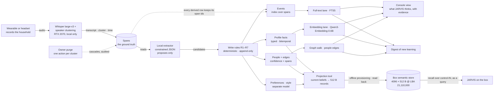

# Phase 7 — Memory Store Design: the household memory that goals 7.1, 7.5 and 7.8 share

**Status:** DESIGN — approved by the operator 2026-09-06 after a three-approach dialogue (approach A below; the extractor runs LOCAL ONLY; the box receives its projection by offline provisioning first). Strategist-authored, plan-first, committed as-is by the coder under an md5 gate (the research memo's precedent). No code is implied by this document; the first code lands under the MS0 board row of §11. The research it rests on is `phase7/docs/PHASE_7_MEMORY_RESEARCH.md` — its §8 nine implications and §8a what the verification votes changed — and every number quoted from that memo keeps the memo's own verification status. Nothing here is a measurement of JARVIS; the bands in §8 are pre-registered before any run.

**One sentence:** three layers (events, profile facts, people) plus a separate preference-and-style model, all over one provenance spine that points back to the verbatim transcript; a deterministic, append-only write path that the language model can add to but never rewrite; retrieval that always returns the span it stands on; our own household benchmark; and a compact projection of current beliefs into the box's existing 4096-slot semantic store.

---

## 0. The decisions this design rests on

**The operator's, recorded in `phase4/docs/BEYOND_PHASE7_VOICE_WEARABLE.md` §8 (2026-09-05/06):** only the owner enrolls; JARVIS must GUESS, over days and untold, that the recurring second voice is his wife and who she is to him; everything is transcribed, raw audio is deleted after transcription, and speech that is neither his nor his wife's is his to purge by hand, one clean action per speaker cluster (his accepted legal risk, recorded not hidden); inferred facts carry a confidence and are USED without confirmation, correction possible never required; the store is purpose-built and to be state of the art, worth a whole phase; the profile is recallable over control-IN, visible on a CLEAN console view, and surfaced in a digest; learning happens on the Main PC, the box receives distilled facts only; training never on the box.

**Taken in the design dialogue of 2026-09-06 (the operator's answers to the strategist):**

1. **The extractor runs LOCAL ONLY.** A model on the RTX 2070 does every extraction over real household transcripts; no household transcript ever leaves the Main PC. A cloud model may be used ONLY to generate SYNTHETIC benchmark transcripts from planted ground truth (§8), never to read a real one. Zero running cost; extraction quality becomes the measured weakest link rather than an assumption.
2. **Approach A — one SQLite file as the spine** — chosen over B (an embedded graph database such as Kuzu) and C (append-only JSONL logs with rebuilt indexes). Rationale: every write is a transaction, so audit rows and supersession chains are trivial and replayable; FTS5 gives the BM25 baseline lane for free; at household scale (thousands of facts, tens of thousands of events) a flat vector scan is milliseconds and the people graph is small enough to walk in Python; backup is a file copy. B forces bitemporal audit rows into a model that does not want them and adds a young dependency for gains the research shows only on multi-hop questions; C grows into A with worse tooling.
3. **The graph question is a measured escape hatch, not a pre-commitment.** The benchmark's who-is-what-to-whom and multi-hop set (§8) is scored against the hand-walked graph at MS2; an embedded graph store is tried only if that set misses its band.
4. **Extractor candidates, in order, measured before trust:** Gemma 4 E2B (the deployed model, known behaviour), Llama 3.1 8B at 4-bit (fits the 2070, ranked first on the fixed-harness re-bench), an encoder-style joint entity-relation extractor as the cheap third. Constrained JSON output only; free text never enters the store.
5. **The box receives its projection by OFFLINE provisioning first:** a Main-PC tool writes the current-beliefs set into the box's existing semantic store region while the box sits on Ubuntu, with the backup, device read-back and neighbour-sector discipline the key and console slots used. A live push over the network would be the box's first standing WRITE path from outside; it is a later, separately gated slice with its own ADR, and control-IN stays a query channel until then.

**The memo's nine implications, each mapped to the section that carries it:** 1 route-by-fact-type over one spine → §2, §3; 2 the LLM off the write path → §4; 3 inference never feeds itself → §3.4, §4 R5; 4 a separate preference and style model → §7; 5 our own pre-registered benchmark → §8; 6 feasible on the 2070 by construction → §0 item 1, §5, §10; 7 forgetting is demotion → §4 R6, §6; 8 the box receives a projection → §9; 9 the honest ceiling → §13.

Sources: `phase4/docs/BEYOND_PHASE7_VOICE_WEARABLE.md` §8; `phase7/docs/PHASE_7_MEMORY_RESEARCH.md` §8, §8a, §10; the operator's answers of 2026-09-06 (this session).

---

## 1. Purpose — one memory, three goals

| Goal (canon, `ROADMAP.md:115-122`) | Its done-when (`ROADMAP.md:126-133`) | What this store contributes | What it does NOT change by itself |
|---|---|---|---|
| 7.1 Associative memory | associative retrieval returns relevant memory for paraphrased queries, test suite ≥ 80 % | typed, sourced facts and a far larger, cleaner corpus than the control-IN store; the same Qwen3-Embedding-0.6B in the embedding lane; the projection (§9) as the box's fact source | the box's own recall lane and its 19/36 = 53 % baseline at the 0.55 floor — 7.1's measurement stays the box-side paraphrase suite, and the store's contribution to it is measured there, never assumed |
| 7.5 Cross-session personality | consistent tone, remembered inside jokes, acknowledged mistakes — grounded in stored facts, not roleplay | the profile, preference and style layers with every fact carrying its span; the audit rows are the "acknowledged mistakes" substrate | anything on the box — 7.5's rendering into the box's prompts is its own arc over the projection |
| 7.8 Household voice learning | days of recordings yield a household profile — who is who and to whom, style and preferences, habits, topics — each fact sourced, dated, stated-or-inferred with a confidence, used without confirmation; the wife identified; recall, a clean console view, a digest | the whole pipeline of §2: this store IS the "purpose-built, state-of-the-art memory store" the done-when names | the wearable, the console view's design and the digest's mechanism, which keep their own board rows |

Sources: `phase4/docs/ROADMAP.md:115-122,126-133`; `phase7/docs/PHASE_7_PLAN.md` §0, §3; CLAUDE.md row "C/M2b — SEMANTIC RECALL WIRED" (the 53 % baseline).

---

## 2. Architecture



**Reading the figure.** The transcript spans are the only ground truth; everything to their right is derived from them by rules and can be recomputed from them. The extractor proposes and the rules decide. Three lanes read the store; three surfaces consume the lanes; the box only ever receives a compact projection, written offline. The purge is the only delete in the system and it runs on spans, cascading to what only those spans produced.

**Venue.** Everything in the figure left of the box runs on the Main PC: the `phase7/memory/` package (§10), the data under `%USERPROFILE%\.jarvis\memory\`, the voice package's venv (torch for ECAPA, faster-whisper) plus the extractor runtime chosen at MS1. The RTX 2070 hosts Whisper (≈3.7 GB measured at M0a) and the extractor in turn, never together; a transcript is extracted after its recording is transcribed, sequentially.

Sources: §0; `phase7/docs/PHASE_7_GOAL_8_VOICE.md` §2, §6 (the measured ASR footprint); `phase3/src/ai/semantic_store.h` (the box region).

---

## 3. Data model

One SQLite database, WAL mode, `household.sqlite`. Every table below is append-only except where a column is documented as set-once-later (`valid_to`, `superseded_by`, `deleted_audio_at`, `person_id` on a cluster). Row ids are monotonic integers; no row is ever renumbered.

### 3.1 The spine — recordings, spans, clusters

| table | columns | meaning |
|---|---|---|
| `recording` | `id`, `sha256`, `started_at` (UTC), `duration_s`, `device` (headset / wearable id), `transcribed_at`, `deleted_audio_at` | one per audio file; `sha256` is computed before transcription and survives the audio's deletion, so a span can always name the recording it came from even though the audio is gone |
| `span` | `id`, `recording_id`, `t_start_s`, `t_end_s`, `cluster_id`, `text` (verbatim ASR output), `asr_conf`, `said_at` (= `started_at` + `t_start_s`), `about_time` (nullable), `about_time_source` (`stated` / `extractor` / null) | the ground truth; `said_at` is dialogue time, `about_time` is occurrence time — kept separately because the research measured a 12-point gain from separating them; a span is never edited, only purged |
| `cluster` | `id`, `centroid` (blob, 192-d ECAPA), `n_spans`, `first_heard`, `days_heard` (distinct dates), `person_id` (nullable, set once when the cluster becomes a person) | a voice, not yet a person; the owner's cluster is bound at creation to the enrollment centroid from `%USERPROFILE%\.jarvis\voice\enroll\owner.json` at its M0b threshold |

### 3.2 The three layers

| table | columns | meaning |
|---|---|---|
| `event` + `event_span` | `id`, `text` (one self-contained natural-language unit with normalised entity names), `about_time`, `cluster_id`, `created_at`; `event_span(event_id, span_id)` | an INDEX over spans, never the truth — the votes refuted the anti-compression claim as causal, so retrieval must be able to fall through an event to its spans |
| `person` | `id`, `kind` (`owner` / `cluster`), `display_name` (nullable), `name_confidence`, `name_source_kind`, `created_at` | the owner (enrolled) and every cluster that has earned personhood (§5) |
| `fact` + `fact_span` | `id`, `subject_kind` (`person` / `household` / `topic`), `subject_id`, `predicate_id` (§4.1), `object_text`, `object_norm`, `source_kind` (`stated_owner` / `stated_other` / `inferred`), `speaker_person_id`, `confidence`, `valid_from`, `valid_to` (nullable), `recorded_at`, `superseded_by` (nullable); `fact_span(fact_id, span_id, role)` with `role` ∈ {`support`, `contradict`} | a typed, bitemporal profile fact: `valid_from`/`valid_to` are when the fact held in the world, `recorded_at` is when the store learned it; `superseded_by` points at the winner and is set exactly once |
| `edge` + `edge_span` | `id`, `from_person`, `to_person`, `relation_id` (§4.1), `source_kind`, `confidence`, `valid_from`, `valid_to`, `recorded_at`, `superseded_by`; `edge_span(edge_id, span_id, role)` | the people layer's relationships — "who is what to whom" — every edge carrying the spans it rests on |
| `audit` | `id`, `ts`, `op` (`supersede` / `demote` / `purge` / `reject`), `target_table`, `loser_id`, `winner_id` (nullable), `rule` (R1…R7 or `registry`), `note` | every loss, kept; the audit table is the reason "nothing is deleted silently" is a property rather than a promise |
| `embedding` | `owner_table`, `owner_id`, `model`, `dim`, `vec` (blob, float32) | vectors for events and facts from the deployed Qwen3-Embedding-0.6B; a flat scan at household scale, a vector extension only if a measured p99 says so |

### 3.3 Preferences and style — the separate model (§7)

| table | columns | meaning |
|---|---|---|
| `preference` + `preference_span` | `id`, `person_id`, `topic_norm`, `polarity` (`likes` / `dislikes` / `wants` / `avoids`), `strength` (1–3), `source_kind`, `confidence`, `valid_from`, `valid_to`, `recorded_at`, `superseded_by` | versioned and coexisting by construction: two preferences on the same topic are two rows until an owner statement closes one |
| `style_snapshot` | `id`, `person_id`, `window_from`, `window_to`, `n_spans`, `stats_json` | statistics over the OWNER'S spans only per window (utterance length, top n-grams, fillers, question rate, address forms); never over anyone else's speech |

### 3.4 Time and confidence — the two conventions

- **Three times, never conflated:** `said_at` (dialogue time, from the recording), `about_time` (occurrence time, inferred and nullable), `recorded_at` (transaction time). A fact's `valid_from` defaults to its `about_time` when the extractor or the speaker gave one, else its `said_at`. `valid_to` is null while the fact is current.
- **Stated facts carry a source, not a probability.** `source_kind` is the load-bearing field; `confidence` on a stated fact is 1.0 by convention and is never rendered as "100 % sure".
- **Inferred confidence is a pre-registered function of evidence days, recomputed from spans every time:** with `D_s` = distinct days carrying supporting spans and `D_c` = distinct days carrying contradicting spans, `confidence = 0` if `D_s ≤ D_c`, else `1 − exp(−(D_s − D_c) / τ)` with `τ = 3 days`. Three consistent days give 0.63, five give 0.81, seven give 0.90. It never reads an earlier inference, so a wrong belief cannot feed itself. The parameters (`τ`, the surfacing threshold 0.80) may change only through the benchmark, with the change and its measured reason recorded in this document.
- **Personhood is a rule:** a cluster becomes a `person` once heard on ≥ 3 distinct days with ≥ 5 spans on each of those days.

Sources: `phase7/docs/PHASE_7_MEMORY_RESEARCH.md` §3 (bitemporal edges, the TSM time separation, the self-reinforcing-error mode), §4 (relationship confidence over days), §8 items 1–3; `phase7/voice/jarvis_voice/enroll.py` (the centroid), `speaker.py` (192-d ECAPA).

---

## 4. The write path — the predicate registry and rules R1–R7

### 4.1 The predicate registry — the K-b instinct applied to memory

The extractor SELECTS a predicate id from a static, human-reviewed table in code; it never invents a predicate, exactly as the action allowlist lets the model select an action id and never synthesise one. A candidate carrying an unknown `predicate_id` is not written; it becomes an `audit` row with `op = reject, rule = registry`.

| predicate_id | subject → object | arity | notes |
|---|---|---|---|
| `person.name` | person → text | single | a display name; the owner's is set at enrollment, a cluster's is earned (§5) |
| `person.relation_to` | person → person, via `relation_id` | multi | the edge table; `relation_id` ∈ a static set (`spouse`, `partner`, `child`, `parent`, `sibling`, `friend`, `colleague`, `housemate`, `other`) |
| `person.lives_in` | person → place text | single | current-value semantics |
| `person.works_as` | person → text | single | |
| `person.habit` | person → text | multi | routines ("walks the dog at 7") |
| `person.trait` | person → text | multi | how they speak, recurring tendencies — always `inferred` |
| `household.topic` | household → topic text | multi | what is talked about; counts accrue in `fact_span` |
| `household.routine` | household → text | multi | |
| `owner.prefers` | owner → topic, via the preference table | multi | routed to §7, not to `fact` |
| `owner.style` | derived, never extracted | — | `style_snapshot` only |

Adding a predicate is a reviewed code change with a test, never a runtime act.

### 4.2 The candidate — what the extractor is allowed to say

One JSON object per candidate, constrained by grammar or schema at generation time:

```
{ "predicate_id": "...", "subject": {"kind": "person|household|topic", "ref": "<cluster or person id, or a normalised name>"},
  "object": "<text>", "object_norm": "<lower-cased, trimmed>", "source_kind": "stated_owner|stated_other|inferred",
  "speaker_cluster": <id>, "span_ids": [<ids>], "about_time": "<ISO date or null>",
  "relation_id": "<one of the static relation set, or null unless predicate_id is person.relation_to>",
  "polarity": "likes|dislikes|wants|avoids|null", "strength": 1|2|3|null,   /* only for owner.prefers */
  "ended": false }
```

`ended: true` means the speaker stated that the value has ended (R4); it is only honoured on a `stated_*` candidate. The freshness key R3 compares is `about_time` when present, else the span's `said_at`; no separate version marker exists.

A candidate with no `span_ids`, with a `span_id` not in the store, or with `source_kind = stated_*` whose speaker cluster does not match the span's cluster, is rejected to `audit` (rule `registry`). The extractor never sees the store's existing facts; it sees spans only, so it cannot be steered by its own prior output.

### 4.3 The rules, in the order they apply

- **R1 — append only.** No row is updated in place. Supersession is a new row plus a `superseded_by` pointer on the old one, set once; the old row keeps its spans.
- **R2 — source rank: `stated_owner` > `stated_other` > `inferred`.** An inferred candidate whose slot (same subject, same single-valued predicate) already holds a stated fact is appended BESIDE it as inferred, never as its successor; a stated candidate may supersede an inferred one. Retrieval ranks by this order.
- **R3 — single-valued predicates: the newest `valid_from` wins by comparison.** Ties break on `said_at`, then `recorded_at`. The loser gets `valid_to = winner.valid_from` and one `audit` row (`op = supersede, rule = R3`). No model reads the pair and decides; the research measured deterministic freshness beating LLM adjudication by about ten points where it was tested, and the same rule's non-replication on knowledge-update questions is why §8 measures it here rather than assuming it.
- **R4 — multi-valued predicates accumulate.** A new candidate on a multi-valued predicate is another current row; it closes nothing. Only an explicit owner statement that a value has ended (`source_kind = stated_owner`, the extractor's `ended` flag on a candidate) sets `valid_to` on the matching row, with an audit row.
- **R5 — confidence is recomputed from spans, every time a candidate touches a subject.** The §3.4 function over `fact_span`/`edge_span` roles; contradicting spans lower it; no earlier inference is an input.
- **R6 — decay demotes, never deletes.** A retrieval-time rank penalty by age since the newest supporting span (§6); an archived fact is a rank of zero, still present, still auditable.
- **R7 — the only delete is the owner's purge, one action per speaker cluster.** `purge <cluster_id>` removes that cluster's spans and every event, fact, edge or preference whose `*_span` rows point ONLY at removed spans; a derived row that also rests on surviving spans is kept with its surviving evidence and its confidence recomputed. The purge writes one `audit` row per removed derived row and one for the cluster (`op = purge, rule = R7`). It is the one operation that may reduce the store, and it is the owner's alone.

Sources: `phase7/docs/PHASE_7_MEMORY_RESEARCH.md` §3 (the four production heuristics as typed operators; the eight-system audit's anomaly classes; deterministic freshness S22), §8 item 2, §8a; `phase3/src/ai/action_allowlist.h` (the select-never-synthesise precedent).

---

## 5. The people layer and the guess

- **Clustering.** Every span ≥ 2 s gets a 192-d ECAPA embedding (the voice package's `SpeakerEmbedder`). The owner's cluster is the enrollment centroid at its M0b threshold: a span scoring ≥ threshold is the owner's. Every other span is clustered agglomeratively on cosine distance; the merge threshold is MEASURED on the public corpus first (39 known speakers from the M0a self-test set, the same negatives), pre-registered as the value that maximises purity × completeness there, and re-reported on real data. Clusters are re-fitted nightly over all retained spans; a cluster id is stable across refits by centroid matching, and a split or merge is an `audit` row.
- **Personhood** is the §3.4 rule: ≥ 3 distinct days, ≥ 5 spans each. A person row is created with no name.
- **Earning a name.** A `person.name` candidate is extracted from vocatives directed at a cluster (the owner addressing the second voice by name, or the reverse) and from third-person references co-occurring with that voice; `name_confidence` follows the §3.4 function; the console shows the leading name with its confidence and its spans.
- **The relationship edge.** `person.relation_to` candidates come from two kinds of evidence, both recorded as `edge_span` rows: (a) the extractor's candidates from spans — an address term ("love", a pet name), a self-description by the owner ("my wife" said within a window of the other voice speaking), a shared-household statement; (b) deterministic evidence rules over the spine — co-occurrence on distinct days, the hour-of-day profile of when the voice is heard at home, the share of household-logistics topics in their joint spans. The rules produce `inferred` candidates with their spans; the confidence is the §3.4 function over distinct days. The rules' exact thresholds (how many co-occurrence days, which address terms, what topic share) are pre-registered in MS2's prompt and measured on the synthetic households before any real transcript is scored; this document fixes the mechanism, not those numbers.
- **The guess is surfaced, never confirmed.** When the owner→cluster edge for `spouse` (or any relation) first reaches ≥ 0.80 it is surfaced on the console and in the digest with its evidence spans; it is also written to the projection (§9). The owner is not asked; if he states otherwise, that statement is `stated_owner` and supersedes by R2. A competing relation on the same pair is a coexisting edge (R4) until evidence separates them.
- **What is claimed.** "JARVIS infers, with confidence c from n days of evidence, that voice B is the owner's wife." Never "JARVIS knows".

Sources: `phase7/docs/PHASE_7_MEMORY_RESEARCH.md` §4 (relation extraction is about the speakers; linking is the weakest task; confidence must accrue over days), §8 item 3; `phase7/docs/PHASE_7_GOAL_8_VOICE.md` §6 (the self-test's 39-speaker set); `phase7/voice/jarvis_voice/speaker.py`.

---

## 6. Retrieval

Three lanes, one ranker, and the span always attached.

- **Full-text lane:** FTS5 over `span.text`, `event.text`, `fact.object_text`; BM25 scores. The always-available baseline, and the lane the research found competitive for current-value questions with no vector store at all.
- **Embedding lane:** cosine over `embedding` rows for events and facts, using the deployed Qwen3-Embedding-0.6B so the Main PC and the box embed the same way; a flat float32 scan at household scale, measured at MS0 (§8) before any index is added.
- **Graph walk:** for a question naming a person or a relation, up to two hops over `edge` from the named person, collecting facts on the reached people. This is the lane the escape hatch (§0 item 3) watches.
- **Ranker:** `score = lane_score × w_source × w_recency × confidence`, with `w_source` = 1.0 / 0.8 / 0.6 for `stated_owner` / `stated_other` / `inferred`, and `w_recency` a half-life decay on the age of the newest supporting span — 90 days for events and inferred facts, none for stated profile facts. Ties by `recorded_at`, newest first. The decay is R6's mechanism: it demotes, and a fact with a recomputed high confidence from fresh spans rises again.
- **Always the span.** Every result carries the ids and verbatim text of the spans it rests on; a consumer (the console, the digest, the projection) can render the evidence without a second query. A realistic `k = 5` is the benchmark's setting; nothing is measured at a top-50 that hides a bad ranker.

Sources: `phase7/docs/PHASE_7_MEMORY_RESEARCH.md` §2 (LoCoMo's retrieval tested only at top-50; the BM25-only pipeline), §3 (S22), §8 item 6; CLAUDE.md row "Embedding Vector Store" (the deployed embedder and its 128-dim projection on the box).

---

## 7. Preferences and style — the separate model

- **Preferences** are the `preference` rows of §3.3: typed by topic, polarity and strength, versioned by `valid_from`/`valid_to`, coexisting by default (R4). A stated preference outranks an inferred one (R2). The console renders the current value AND its history, so "used to like X, now avoids it" is visible as two rows rather than a silent overwrite.
- **Style** is learned from the owner's own spans only, as `style_snapshot` statistics per window; it is never extracted by the model and never inferred from anyone else's speech. Its consumer is goal 7.5's rendering into the box's prompts, a later arc; here it is stored and shown.
- **Why separate.** The memo's votes left the preference gap real as a number and unproven as a mechanism: nobody has shown why event memory misses preferences, and full-context scored worst on the same questions. So the separation is a shape the evidence supports without a mechanism it proves, and §8 carries a preference-transfer set from day one so JARVIS's own measurement settles it.

Sources: `phase7/docs/PHASE_7_MEMORY_RESEARCH.md` §6, §8 item 4, §8a (the third bullet).

---

## 8. The benchmark — pre-registered before the first run

**Corpus.** Ten SYNTHETIC households, each generated from a planted ground-truth file (people, relationships, facts with dated updates, coexisting facts, preferences with dated changes, habits and topics) into day-by-day transcripts with speaker labels, by a cloud model — permitted because the text is synthetic (§0 item 1) — plus filler transcripts of unrelated household talk for the growth set. Real household transcripts join as they accrue, with hand-labelled gold for a sample; real-data numbers are REPORTED and set no band until a first measurement exists.

**Five sets and their metrics.**

| set | what it tests | metric | band (MS0, oracle candidates) | band (MS2, extracted candidates) |
|---|---|---|---|---|
| knowledge updates | a single-valued fact changes on a dated day | current-value accuracy at k = 5 with the span attached | ≥ 95 % | ≥ 85 % |
| coexisting facts | two values on a multi-valued predicate | recall of both current values | ≥ 95 % | ≥ 85 % |
| preference transfer | a stated preference must be found for a NEW scenario worded without the preference's own words | transfer recall at k = 5: the planted preference row is in the top five for the scenario query | ≥ 60 % | ≥ 60 % |
| who-is-what-to-whom | the planted relationships, incl. the spouse edge | precision of surfaced relations at confidence ≥ 0.80; the spouse edge surfaced within 7 synthetic days | precision = 1.0 (oracle) | precision ≥ 0.90; spouse surfaced in ≥ 8 of 10 households; 0 wrong relations surfaced |
| evidence-preserving growth | the same facts after 30× unrelated transcript is added | drop in update-set accuracy | ≤ 5 points | ≤ 5 points |

The transfer set measures whether the store SURFACES the right preference for an unfamiliar scenario; applying it in an answer is goal 7.5's arc and is not scored here, so no answering model is part of this benchmark.

**Cross-cutting bands.** Audit completeness 100 % (every `superseded_by`, every demotion, every purge has its `audit` row — asserted by a test that walks the store). Write latency p99 ≤ 50 ms per candidate at 100,000 facts, single process, on the Main PC. Extractor JSON validity ≥ 99 % of candidates (MS1); the bake-off picks the highest candidate F1 among models that clear validity, with a floor of F1 ≥ 0.60 on the synthetic candidate set — below the floor the number is recorded as the ceiling and every inference claim in §5 narrows accordingly, and the escape hatch of §0 item 3 applies to the who-is-what-to-whom set specifically.

**Rules of the benchmark.** Bands are fixed here before code exists. A number outside its band is a finding with a cause named, never a knob turned; a knob (`τ`, the 0.80 threshold, the clustering threshold, the ranker weights) changes only with the measured reason written into this document. No vendor number is ever the target — the memo's §2 is the reason.

Sources: `phase7/docs/PHASE_7_MEMORY_RESEARCH.md` §2 (benchmark defects), §3 (MemFail's two storage failures), §6 (PersonaMem transfer), §8 item 5, §8a (the fourth bullet).

---

## 9. The projection to the box

The Main PC holds the store; the box receives a compact set of CURRENT BELIEFS in the format its semantic store already defines, written offline.

- **Target:** the `JSEM` region — header at LBA 21,110,000, 4096 × 512 B `semantic_fact_t` records at +1…+4096 (`phase3/src/ai/semantic_store.h`), between the episodic store (ends 21,108,192) and the JACT audit store (21,120,000). It is inside the GPT gap `parted` reports as free space and is NOT free — the standing rule in CLAUDE.md applies verbatim.
- **Mapping:** `key` = FNV-1a over the canonical string `predicate_id|subject_norm` (decision-cache parity, so a repeated subject upserts rather than duplicates); `fact_type` = a new `SEM_FACT_PROFILE` (value 2) beside the existing `SEM_FACT_QA` (1); `support_count` = supporting evidence days; `confidence_x100` = the §3.4 confidence × 100 (stated facts 100); `text` ≤ 440 B = "subject predicate object (stated|inferred, n days)"; `t_ms` = the newest supporting span's `said_at`; `boot_id`/`seq` left 0 for the box to stamp on upsert.
- **Selection:** current rows only (`valid_to` null); stated facts always; inferred facts and edges at confidence ≥ 0.80; then by ranker score until 4096. The projection is a distillation target, never the archive: nothing the box holds is the only copy of anything.
- **The tool's discipline** is the JKEY/JCON one: back up the region to a file whose md5 is recorded; build the sector image on the Main PC from the store; `dd` it while the box is on Ubuntu; read it back from the device past `drop_caches` with `iflag=direct` and compare md5; md5 every neighbour sector on both sides before and after; keep the pre-image as the rollback. The tool never runs while JARVIS is booted.
- **The box side is a separate, gated slice.** Today `JARVIS_SEMANTIC` is default-0 and G3 retrieval reads the episodic and control-IN stores only; making the box read `JSEM` is a later box milestone with its own KVM gate and OFF-identity proof, on the Phase 7 board, not this document's build. Until then the projection proves the round trip byte-for-byte and nothing about recall.
- **A live push is deliberately absent.** Control-IN carries queries; an inbound WRITE into the box's memory from the network is a new attack surface (a spoofed or replayed fact would be a belief injection) and gets its own ADR and checklist before any code — the 6-5 precedent.

Sources: `phase3/src/ai/semantic_store.h`; CLAUDE.md rows "Semantic Memory (Phase 5 #4/M0)", "Control-IN Reply Address" (the JCON discipline), "Control-IN Replay Floor" (the storage map and the never-partition rule); `phase7/docs/PHASE_7_MEMORY_RESEARCH.md` §8 item 8.

---

## 10. Package, venue, tests

- **Code:** `phase7/memory/jarvis_memory/` — `registry.py` (the predicate and relation tables), `rules.py` (R1–R7 as pure functions over plain dicts), `confidence.py` (§3.4), `freshness.py` (the R3 comparison), `schema.py` (the DDL), `store.py` (the `sqlite3` layer), `people.py` (clustering, the evidence rules of §5; numpy/torch imported inside functions), `extract.py` (the extractor adapters, MS1), `retrieve.py` (§6), `bench/` (corpus generator, harness, the pre-registered bands as data), `project.py` (the §9 record builder; the `dd` step is an operator script with the JCON discipline), `__main__.py` (`python -m jarvis_memory ingest|extract|query|purge|bench|project`).
- **Data:** `%USERPROFILE%\.jarvis\memory\` — `household.sqlite`, `bench\`, `exports\`; never in the repo. `.gitignore` gains `phase7/memory/**/*.sqlite*` and the data root is already covered by the `.jarvis/` rule.
- **Tests:** `phase7/memory/test_memory_logic.py`, standard library only (the voice package's precedent) over the pure modules: the registry, R1–R7 on hand-built candidates, the §3.4 function at its three named points, the R3 freshness comparison and its tie-breaks, the R7 cascade rule, the audit-completeness walker on an in-memory SQLite → one CI step `"Phase 7: memory store logic (Python, stdlib-only)"`. The GPU paths are never imported by the test.
- **Venue:** the Main PC; the voice venv (`%USERPROFILE%\.jarvis\voice\venv`) for ECAPA and Whisper; the extractor runtime chosen at MS1 with its version and licence recorded as the voice package did.

Sources: `phase7/voice/` (the package, test and CI precedents); CLAUDE.md §Rules (every test file has a CI step).

---

## 11. Milestones — board rows

Each row flips DONE only with the landing commit's hash and the measured numbers; the umbrella row "The memory store … + the guess" stays until MS2's real-data guess exists.

| row | what lands | done-when (the §8 bands) |
|---|---|---|
| MS0 — the store and the rules | schema, registry, R1–R7, audit, purge, the benchmark harness and the synthetic corpus, driven by ORACLE candidates | update ≥ 95 %, coexisting ≥ 95 %, transfer ≥ 60 %, audit 100 %, p99 ≤ 50 ms at 100k, growth drop ≤ 5 |
| MS1 — the extractor bake-off | the three candidates on the 2070 over the synthetic corpus; one chosen | JSON validity ≥ 99 %; the highest F1 among those; F1 ≥ 0.60 floor, else the ceiling recorded |
| MS2 — real transcripts, people, the guess | end to end from the owner's transcripts once the voice pipeline produces them; clustering; the edge accruing over days; the synthetic MS2 bands, then real data reported | synthetic: update ≥ 85 %, coexisting ≥ 85 %, precision ≥ 0.90, spouse surfaced in ≥ 8/10, 0 wrong; real: reported |
| MS3 — the projection tool | the §9 record builder + the operator's provisioning script | records written and read back byte-equal, neighbours md5-identical, rollback retained |

The console view and the digest keep the rows they already have on the board.

Sources: `phase7/docs/PHASE_7_PLAN.md` §0 (the board rule and the existing 7.8 rows).

---

## 12. Risks

- **Extraction quality on an 8 GB GPU** is the binding constraint the research names; it is measured at MS1 with a floor, and every inference claim narrows if the floor is missed.
- **Clustering drift** (a voice split across clusters, two voices merged) silently distorts the people layer; nightly refits are audited and the public-corpus purity measurement is re-run on real data.
- **VRAM contention:** Whisper and the extractor never run together; the ingest is sequential by design.
- **The SQLite file is one file:** nightly copies to `exports\` with md5s; the audit table makes a restore checkable.
- **The legal exposure** of recording non-household speech is the owner's accepted risk, recorded in the idea doc §8 and not restated as smaller here; the purge (R7) is the mitigation and it depends on the owner doing it.
- **The escape hatch** (§0 item 3) is the only planned architecture change; it is triggered by a measured miss on one set, never by preference.

---

## 13. Honest ceiling and wording

Every system the research measured is wrong a large fraction of the time at conflict resolution, relationship inference and preference transfer. This design does not promise that JARVIS will be right. It promises that every belief is visible with the spans it rests on, that a wrong one is reversible without losing anything, and that all of it is measured against our own pre-registered benchmark. The wording discipline for every shipped slice: "infers, with confidence c from n days of evidence", "stated by the owner on <date>", "recalled from <recording>" — never "knows", "understands", "remembers your life".

Sources: `phase7/docs/PHASE_7_MEMORY_RESEARCH.md` §8 item 9; `phase7/docs/PHASE_7_GOAL_8_VOICE.md` §1 (the fiction table), §8.

---

## 14. Sources

`phase7/docs/PHASE_7_MEMORY_RESEARCH.md` (§0 ledger, §2–§8, §8a, §9 the 24 sources) · `phase4/docs/BEYOND_PHASE7_VOICE_WEARABLE.md` §8 · `phase4/docs/ROADMAP.md:115-133` · `phase7/docs/PHASE_7_PLAN.md` §0–§3 · `phase7/docs/PHASE_7_GOAL_8_VOICE.md` §2, §6 · `phase3/src/ai/semantic_store.h` · `phase3/src/ai/action_allowlist.h` · `phase7/voice/jarvis_voice/{enroll,speaker,evaluate}.py` · CLAUDE.md rows "Semantic Memory (Phase 5 #4/M0)", "Embedding Vector Store", "Control-IN Reply Address", "Control-IN Replay Floor", "C/M2b — SEMANTIC RECALL WIRED" · the operator's decisions of 2026-09-05 and 2026-09-06.
